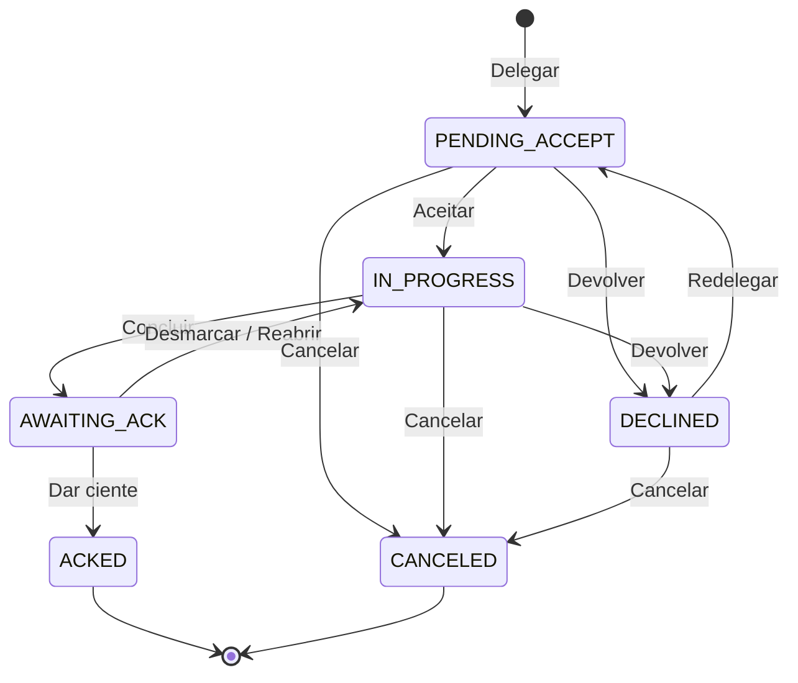

# SyncTasks: especificação funcional e técnica

> O aplicativo se chamava **SyncTasks** até a terceira rodada de ajustes (ver `docs/feedback.md`, item 13).

| | |
|---|---|
| **Versão** | 1.0 (rascunho para validação) |
| **Data** | 04/10/2026 |
| **Status** | Jornadas validadas. Amostra visual aprovada. **Primeira versão implementada** (`apps/api`, `apps/web`), com três rodadas de ajustes do teste (`docs/feedback.md`); ver README. |
| **Público** | ~90 a 99 pessoas da Nerus |
| **Protótipo navegável** | https://claude.ai/artifact/PzRKBmbgfbtbztuQDLnWcd |
| **Amostra do visual aprovado** | https://claude.ai/artifact/VS56Z1i99KfRCXToV47EHm |

---

## Sumário

1. [Contexto e objetivo](#1-contexto-e-objetivo)
2. [Escopo](#2-escopo)
3. [Glossário](#3-glossário)
4. [Papéis e hierarquia](#4-papéis-e-hierarquia)
5. [Visibilidade e permissões](#5-visibilidade-e-permissões)
6. [Jornadas](#6-jornadas)
7. [Regras de negócio](#7-regras-de-negócio)
8. [Código da tarefa](#8-código-da-tarefa)
9. [Ciclo de vida da delegação](#9-ciclo-de-vida-da-delegação)
10. [Log (histórico) da tarefa](#10-log-histórico-da-tarefa)
11. [Avisos e e-mails](#11-avisos-e-e-mails)
12. [Telas](#12-telas)
13. [Diretrizes de interface](#13-diretrizes-de-interface)
14. [Modelo de dados](#14-modelo-de-dados)
15. [API](#15-api)
16. [Requisitos não funcionais](#16-requisitos-não-funcionais)
17. [Arquitetura, hospedagem e custos](#17-arquitetura-hospedagem-e-custos)
18. [Plano de entrega](#18-plano-de-entrega)
19. [Critérios de aceite](#19-critérios-de-aceite)
20. [Questões em aberto](#20-questões-em-aberto)
    - [Painel e captura da web](#20a-painel-e-captura-da-web-terceira-rodada)
21. [Fora do escopo e evoluções futuras](#21-fora-do-escopo-e-evoluções-futuras)

---

## 1. Contexto e objetivo

A Nerus tem cerca de 90 pessoas organizadas em quatro níveis: **CEO > Diretores > Gestores > Funcionários**. Cada pessoa precisa organizar o próprio trabalho com liberdade, como no Trello. Os superiores precisam saber, sem esforço, o que delegaram e em que pé está.

**O problema que o produto resolve:**

> "Quais atividades deleguei para meus funcionários que ainda não foram concluídas? Posso mandar mais tarefas?"

**Objetivos da primeira versão:**

1. Cada pessoa organiza suas tarefas em quadros e fases livres.
2. O superior delega tarefas ao subordinado direto e acompanha o status até dar o ciente.
3. O superior vê, numa única tela, a situação de cada subordinado: abertas, atrasadas, aguardando ciente, devolvidas e volume de tarefas próprias.
4. Tudo o que acontece com uma tarefa fica registrado e pode ser consultado a qualquer momento.
5. Cada evento importante gera aviso no app e por e-mail.

---

## 2. Escopo

### 2.1 Dentro do escopo (v1)

- Cadastro de pessoas e da hierarquia, feito pelo administrador.
- Login com e-mail e senha. A senha é definida pelo link enviado por e-mail.
- Quadros pessoais com fases (listas) livres: criar, renomear, reordenar e arquivar (só quando vazias).
- Tarefas com título, descrição, prazo, checklist, comentários, privacidade e código único.
- Arrastar tarefas entre fases.
- Delegação ao subordinado direto, com caixa de entrada, devolução justificada, conclusão, ciente, reabertura, cancelamento e redelegação.
- Transferência de tarefa (diferente de delegar).
- Transferência de gestão, feita pelo administrador.
- Tela **Tarefas delegadas** para quem tem subordinados.
- Log completo e imutável de cada tarefa.
- Busca por texto e por código.
- Avisos no app e e-mails pelo Google Workspace.
- PWA instalável no celular. Tamanho do texto ajustável. Tema claro e escuro.

### 2.2 Fora do escopo (v1)

Anexos e integração com o Google Drive, trabalho entre times, vários responsáveis por tarefa, quadros compartilhados, indicador de performance, registro de horas, etiquetas, @menções, data de início, lembretes, modelos, filtros avançados, calendário, automações e integrações. A seção 21 traz a lista completa.

---

## 3. Glossário

| Termo | Significado |
|---|---|
| **Quadro** | Espaço pessoal de organização. Cada pessoa cria quantos quiser. |
| **Fase (lista)** | Coluna de um quadro, como "A fazer" ou "Fazendo". Nomes e quantidade são livres. |
| **Tarefa (cartão)** | Item de trabalho. Pertence a uma única pessoa (o **detentor**). |
| **Tarefa própria** | Tarefa criada pela própria pessoa, sem delegação. |
| **Delegar** | O superior entrega uma tarefa ao **subordinado direto** e continua acompanhando até dar o ciente. |
| **Delegador** | Quem delegou. |
| **Cartão ligado** | Na delegação, o delegador mantém o próprio cartão e o subordinado recebe um cartão novo, ligado ao primeiro. |
| **Desdobramento** | O cartão recebido por delegação, visto em relação ao cartão de origem. |
| **Caixa de entrada** | Lugar onde chegam delegações e transferências antes de a pessoa colocá-las num quadro. |
| **Devolver** | O subordinado recusa a delegação, com justificativa obrigatória. |
| **Concluir** | Marcar a tarefa como feita. Independe da fase em que ela está. |
| **Ciente** | Validação do delegador sobre uma tarefa concluída. Arquiva a tarefa. |
| **Reabrir** | O delegador não aceita a conclusão e devolve a tarefa com comentário. |
| **Transferir** | Passar a tarefa a outra pessoa. Quem transfere deixa de acompanhar. |
| **Transferir gestão** | O administrador muda o superior direto de uma pessoa. |
| **Log** | Registro imutável de tudo o que aconteceu com a tarefa. |

---

## 4. Papéis e hierarquia

### 4.1 Níveis

| Nível | Papel | Superior direto |
|---|---|---|
| 0 | CEO | nenhum |
| 1 | Diretor | CEO |
| 2 | Gestor | Diretor |
| 3 | Funcionário | Gestor |
| (fora da árvore) | Administrador | não se aplica |

- Cada pessoa tem **exatamente um** superior direto, exceto o CEO.
- O superior de uma pessoa está **sempre no nível imediatamente acima**.
- A hierarquia é uma árvore de pessoas. Não existe o conceito de "time" como entidade.
- **Subordinados diretos** são as pessoas cujo superior direto é você.
- O **administrador** é um papel de sistema, fora da árvore. Ele não delega nem recebe tarefas. A mesma pessoa pode ter as duas coisas: um cargo na árvore e a permissão de administrador.

### 4.2 Administração da estrutura

Só o administrador:
- cadastra pessoas (nome, e-mail, cargo, superior direto);
- ativa e desativa pessoas;
- executa a **transferência de gestão** (seção 7.9).

---

## 5. Visibilidade e permissões

### 5.1 Princípios

1. **Os quadros são pessoais.** Ninguém além do dono vê os quadros e as fases de uma pessoa.
2. **O superior vê só as delegações que ele mesmo fez,** e apenas aos subordinados diretos.
3. **De cada subordinado, o superior vê só um número de tarefas próprias,** apenas para conhecimento. O conteúdo dessas tarefas nunca aparece.
4. **Tarefas privadas nunca aparecem para superiores.**
5. **Por enquanto, o log é visível só para administrador, CEO e diretores** (seção 10).
6. Toda regra é verificada no servidor. A interface apenas reflete o que a API permite.

### 5.2 Matriz

| Ação ou dado | Funcionário | Gestor | Diretor | CEO | Admin |
|---|:-:|:-:|:-:|:-:|:-:|
| Ver e editar os próprios quadros, fases e tarefas | ✔ | ✔ | ✔ | ✔ | — |
| Ver quadros de outra pessoa | ✘ | ✘ | ✘ | ✘ | ✘ |
| Delegar (ao subordinado direto) | ✘ | ✔ | ✔ | ✔ | — |
| Ver a tela Tarefas delegadas | ✘ | ✔ | ✔ | ✔ | — |
| Ver as tarefas que **ele** delegou | — | ✔ | ✔ | ✔ | — |
| Ver delegações feitas por outros (drill-down) | ✘ | ✘ | ✘ | ✘ | ✘ |
| Ver o contador de tarefas próprias de subordinado direto | — | ✔ | ✔ | ✔ | — |
| Ver o log de tarefas | ✘ | ✘ | ✔ * | ✔ * | ✔ * |
| Cadastrar pessoas e definir superior | ✘ | ✘ | ✘ | ✘ | ✔ |
| Transferir gestão | ✘ | ✘ | ✘ | ✘ | ✔ |

\* A abrangência ainda está em aberto: todas as tarefas ou só as da diretoria. Ver a seção 20.

---

## 6. Jornadas

### 6.1 Funcionário

1. Abre o app em **Meus quadros** e organiza as tarefas nas fases que criou.
2. Vê um número na **Caixa de entrada** quando chega uma delegação.
3. Abre a caixa de entrada e, para cada item:
   - **aceita**, escolhendo em qual quadro e fase colocar; ou
   - **devolve**, com justificativa obrigatória.
4. Trabalha na tarefa: move entre fases, marca itens do checklist, comenta e ajusta o prazo se precisar. Ao mudar o prazo, o delegador recebe aviso.
5. Clica em **Concluir**. A tarefa fica "aguardando ciente" para o superior.
6. Recebe aviso quando o superior dá o ciente (a tarefa é arquivada) ou reabre (com o motivo).

### 6.2 Gestor (vale também para diretor e CEO)

1. Cria a tarefa no próprio quadro.
2. Abre a tarefa e usa **Delegar**: escolhe o subordinado direto, o prazo sugerido e, se quiser, uma observação.
3. Acompanha em **Tarefas delegadas**:
   - a seção **Precisam da sua ação** lista o que aguarda ciente e o que foi devolvido;
   - a seção **Equipe** traz uma linha por subordinado, com contadores (abertas, atrasadas, aguardando ciente, devolvidas, próprias) e a lista de tarefas delegadas a cada um.
4. Para tarefas concluídas: **Dar ciente** (arquiva) ou **Reabrir** (com comentário obrigatório).
5. Para tarefas devolvidas: **Redelegar**, para a mesma ou outra pessoa, ou **Cancelar**.
6. Decide se pode mandar mais trabalho olhando os contadores. Por enquanto, a avaliação é só visual.

### 6.3 Delegação em cadeia (diretor, gestor e funcionário)

1. O diretor delega uma tarefa ao gestor. O cartão do gestor chega na caixa de entrada dele.
2. O gestor abre esse cartão e usa **Delegar** para repassar ao funcionário. O funcionário recebe um **novo** cartão, com código próprio, ligado ao cartão do gestor.
3. O cartão do gestor ganha o ícone **repassada para [funcionário]**. O diretor também vê esse ícone, só para conhecimento.
4. O funcionário conclui, o gestor dá o ciente e depois conclui o próprio cartão. Então o diretor dá o ciente.

### 6.4 Administrador

1. Cadastra uma pessoa com nome, e-mail, cargo e superior direto. A pessoa recebe o link para definir a senha.
2. Quando alguém muda de gestor, executa **Transferir gestão**. As delegações em aberto passam ao novo gestor e o histórico fica com o antigo.
3. Ativa ou desativa pessoas.

---

## 7. Regras de negócio

### 7.1 Quadros e fases

- **RN-01** Cada pessoa cria quantos quadros quiser. Um quadro novo começa com as fases "A fazer", "Fazendo" e "Feito".
- **RN-02** Fases podem ser criadas, renomeadas e reordenadas livremente.
- **RN-03** Uma fase **só pode ser arquivada se estiver vazia**. Se houver tarefas, o app bloqueia e pede para movê-las antes.
- **RN-04** A fase em que a tarefa está não define se ela está concluída. A conclusão é um ato explícito (RN-12).
- **RN-05** Todo usuário novo recebe automaticamente um quadro "Meu trabalho".
- **RN-05a** O detentor pode **arquivar uma tarefa própria concluída** e desarquivá-la depois. Não pode arquivar tarefa recebida por delegação (quem arquiva é o delegador, ao dar o ciente, RN-25) nem tarefa com delegação para baixo em aberto.

### 7.2 Tarefas

- **RN-06** Campos: título (obrigatório, até 200 caracteres), descrição (texto, opcional), prazo (data, opcional), checklist, comentários, privacidade e código (seção 8).
- **RN-07** Toda tarefa tem **um único detentor**.
- **RN-08** Uma **tarefa privada** nunca aparece para superiores, nem nos contadores de tarefas próprias. Uma tarefa recebida por delegação **não pode** ser privada.
- **RN-09** O **checklist** é uma lista de itens com texto e marcação. Mostra o progresso (por exemplo, 3/5) no cartão e na tela Tarefas delegadas. Quem edita o checklist é o detentor.
- **RN-10** Comentários são permitidos ao detentor e, em tarefas delegadas, ao delegador. Comentários não podem ser editados nem apagados, porque fazem parte do log.
- **RN-11** Uma tarefa é ordenada dentro da fase por posição fracionária, para que reordenar não exija regravar as demais.
- **RN-12** O botão **Concluir** marca a tarefa como feita. Em tarefa própria, a tarefa simplesmente fica concluída. Em tarefa delegada, ela passa a **aguardar o ciente** do delegador (seção 9).
- **RN-13** Uma tarefa concluída e ainda sem ciente pode ser desmarcada pelo detentor. Ela volta a "em andamento".

### 7.3 Delegação

- **RN-14** Só delega quem tem subordinados diretos, e **só para um subordinado direto**. Nunca se pula nível nem se delega para cima.
- **RN-15** **Não existe "delegar" avulso.** A tarefa é criada primeiro (ou recebida) e o botão **Delegar** fica dentro dela.
- **RN-16** Ao delegar, o sistema cria **um novo cartão** para o subordinado, com **código próprio**, ligado ao cartão de origem (`parent`). O título e a descrição são copiados. Prazo sugerido e observação são opcionais. A observação vira o primeiro comentário.
- **RN-17** Cada cartão pode ter **uma delegação ativa** por vez. Para delegar de novo, a anterior precisa estar cancelada ou ter recebido o ciente.
- **RN-18** A delegação vai para **uma pessoa**. Para três pessoas, são três tarefas.
- **RN-19** O cartão delegado chega na **caixa de entrada** do subordinado.
- **RN-20** O **prazo** sugerido pode ser alterado livremente pelo subordinado. Cada alteração avisa o delegador por e-mail e fica registrada no log, com o valor anterior e o novo.

### 7.4 Caixa de entrada

- **RN-21** Ficam na caixa de entrada as delegações novas e as tarefas transferidas, até serem colocadas num quadro.
- **RN-22** **Aceitar** significa escolher o quadro e a fase de destino.
- **RN-23** **Devolver** exige justificativa. A tarefa sai do subordinado e aparece para o delegador como **Devolvida**.
- **RN-24** Uma tarefa transferida não pode ser devolvida pela caixa de entrada, só aceita. Se o detentor não quiser, pode transferi-la de novo.

### 7.5 Ciente, reabertura, cancelamento e redelegação

- **RN-25** **Dar ciente** em tarefa concluída arquiva a tarefa e avisa o detentor.
- **RN-26** **Reabrir** exige comentário com o motivo. A tarefa volta para "em andamento", marcada como reaberta, e o detentor é avisado.
- **RN-27** Sem ciente, a tarefa fica pendente na tela do delegador **indefinidamente**. Não há prazo automático.
- **RN-28** **Cancelar** uma delegação, em andamento ou devolvida, arquiva o cartão do subordinado como cancelado e o avisa. O cartão de origem fica livre para nova delegação.
- **RN-29** **Redelegar** uma tarefa devolvida a envia para o mesmo ou outro subordinado direto, opcionalmente com novo prazo. **O código é mantido.**

### 7.6 Transferência de tarefa

- **RN-30** O detentor pode transferir uma tarefa para: um **subordinado direto**, um **colega do mesmo nível com o mesmo superior** ou o **próprio superior direto**.
- **RN-31** Quem transfere **deixa de acompanhar** a tarefa.
- **RN-32** Se a tarefa transferida tiver sido **delegada**, o delegador original **continua acompanhando**, com a marca "delegada para [novo detentor]", e continua responsável pelo ciente. O delegador não aparece como destino possível.
- **RN-33** A tarefa transferida chega na caixa de entrada do destino. O código é mantido.

### 7.7 Visibilidade nas telas do superior

- **RN-34** A tela Tarefas delegadas lista só os subordinados diretos e só as tarefas que o usuário delegou.
- **RN-35** O contador **próprias** mostra quantas tarefas não delegadas, abertas e não privadas o subordinado tem, sem mostrar o conteúdo.

### 7.8 Busca

- **RN-36** O campo de busca aceita um **código** (`ST-000123`, `123`, `st123` ou o formato antigo `NT-000123`), que abre a tarefa direto, ou um **texto**, que busca no título e na descrição.
- **RN-37** A busca só retorna tarefas que o usuário pode ver: as dele e as que ele delegou.

### 7.9 Transferência de gestão

- **RN-38** O administrador escolhe a pessoa e o novo superior, que deve estar no nível imediatamente acima.
- **RN-39** **Todas as delegações em aberto** que o superior antigo fez a essa pessoa passam a ter o novo superior como delegador. Isso inclui as aguardando aceite, em andamento, concluídas aguardando ciente e devolvidas.
- **RN-40** O histórico e as tarefas já arquivadas continuam com o superior antigo.
- **RN-41** Os três envolvidos são avisados: a pessoa, o novo superior e o antigo. A mudança fica registrada em `ManagerChange` e no log de cada tarefa afetada.

### 7.10 Pessoas desativadas

- **RN-42** Uma pessoa desativada não faz login, não aparece como destino de delegação nem de transferência, e mantém seus registros no log.
- **RN-43** Antes de desativar alguém com subordinados ou delegações em aberto, o administrador precisa transferir a gestão e as tarefas. O sistema bloqueia e lista as pendências.

---

## 8. Código da tarefa

- **RN-44** Toda tarefa recebe um código único e legível: **`ST-` seguido de no mínimo 6 dígitos**, por exemplo `ST-000001`. Até a troca de nome o prefixo era `NT-`; os códigos antigos continuam sendo aceitos na busca e nos links (o número é o mesmo).
- **RN-45** O código é gerado por uma sequência do banco (`BIGINT`). **Nunca é reutilizado**, nem após cancelamento ou arquivamento.
- **RN-46** **Não há teto.** O número é exibido com zeros à esquerda até 6 dígitos. A partir de 1.000.000 a exibição cresce naturalmente (`ST-1000000`), sem quebrar nada.
- **RN-47** Transferir, redelegar, dar ciente e reabrir **mantêm** o código. Uma nova delegação gera um **novo** cartão, portanto um novo código.
- **RN-48** O código aparece no cartão, nas listas, na caixa de entrada, na tela Tarefas delegadas, no log e no **assunto dos e-mails**.

**Capacidade.** Com cerca de 99 pessoas criando 10 tarefas por dia útil (cerca de 250 dias por ano), o volume é de aproximadamente 250 mil tarefas por ano. Seis dígitos (999.999) cobrem cerca de 4 anos nesse ritmo, que é alto. Depois disso o código passa a ter 7 dígitos automaticamente. O formato anterior, com 4 dígitos (9.999), se esgotaria em poucos dias.

---

## 9. Ciclo de vida da delegação

### 9.1 Estados

| Estado | Ícone | Significado | Cor |
|---|---|---|---|
| `PENDING_ACCEPT` | caixa de entrada | Na caixa de entrada do subordinado, ainda não aceita | neutra |
| `IN_PROGRESS` | relógio | Aceita, em andamento | neutra |
| `IN_PROGRESS` + `reopened` | seta circular | Reaberta pelo delegador, em andamento | neutra |
| `AWAITING_ACK` | ampulheta | Concluída, aguardando ciente | **âmbar** (pede ação) |
| `DECLINED` | seta de retorno | Devolvida com justificativa | **âmbar** (pede ação) |
| `ACKED` | arquivo | Ciente dado, tarefa arquivada | neutra |
| `CANCELED` | x | Cancelada pelo delegador | neutra |

"Atrasada" não é um estado: é uma condição (`prazo < hoje` e tarefa não concluída). Aparece em **vermelho** no prazo.

### 9.2 Transições

| De | Ação | Quem | Para | Efeitos |
|---|---|---|---|---|
| (novo) | Delegar | delegador | `PENDING_ACCEPT` | cria cartão ligado; aviso e e-mail ao subordinado |
| `PENDING_ACCEPT` | Aceitar | subordinado | `IN_PROGRESS` | cartão vai para o quadro e fase escolhidos |
| `PENDING_ACCEPT` / `IN_PROGRESS` | Devolver (justificativa) | subordinado | `DECLINED` | some do subordinado; aviso e e-mail ao delegador |
| `IN_PROGRESS` | Concluir | subordinado | `AWAITING_ACK` | aviso e e-mail ao delegador |
| `AWAITING_ACK` | Desmarcar conclusão | subordinado | `IN_PROGRESS` | registro no log |
| `AWAITING_ACK` | Dar ciente | delegador | `ACKED` | arquiva; aviso e e-mail ao subordinado |
| `AWAITING_ACK` | Reabrir (comentário) | delegador | `IN_PROGRESS` + `reopened` | aviso e e-mail ao subordinado |
| `DECLINED` | Redelegar | delegador | `PENDING_ACCEPT` | mesmo código; novo destinatário possível |
| `PENDING_ACCEPT` / `IN_PROGRESS` / `DECLINED` | Cancelar | delegador | `CANCELED` | arquiva; aviso ao subordinado |
| qualquer aberto | Alterar prazo | subordinado | (mesmo) | aviso e e-mail ao delegador |
| qualquer aberto | Transferir | detentor | `PENDING_ACCEPT` no destino | delegador mantido (RN-32) |

Qualquer transição não listada é rejeitada pela API com erro 409.

---

## 10. Log (histórico) da tarefa

- **RN-49** **Tudo** o que acontece com uma tarefa é gravado.
- **RN-50** O log é **somente inserção**. Ninguém edita nem apaga registros, nem o administrador. A regra é garantida no banco (permissões e trigger).
- **RN-51** Cada registro guarda: data e hora (UTC, exibidas em America/Sao_Paulo), autor, tipo de evento, tarefa (código) e, quando houver, **valor anterior e novo**.
- **RN-52** O log fica acessível **a qualquer momento**, inclusive depois de a tarefa ser arquivada ou cancelada, pelo código.
- **RN-53** **Por enquanto, só administrador, CEO e diretores** veem o log. A abrangência está em aberto (seção 20).

**Eventos registrados**

| Grupo | Eventos |
|---|---|
| Criação e edição | criada; título alterado; descrição alterada; prazo alterado; privacidade alterada |
| Organização | movida de fase ou quadro; aceita (destino) |
| Checklist | item adicionado, editado, removido, marcado, desmarcado |
| Comentários | comentário adicionado |
| Delegação | delegada (para quem, prazo sugerido); devolvida (justificativa); concluída; conclusão desfeita; ciente dado; reaberta (motivo); cancelada; redelegada |
| Transferência | transferida (de, para) |
| Estrutura | gestão transferida (delegador antigo → novo) |

---

## 11. Avisos e e-mails

### 11.1 Eventos

Cada evento gera um **aviso no app** e um **e-mail**:

| Evento | Quem recebe | Assunto do e-mail (exemplo) |
|---|---|---|
| Nova delegação | subordinado | `[ST-000123] Marina delegou: Conferir notas fiscais` |
| Delegação devolvida | delegador | `[ST-000123] João devolveu: Conferir notas fiscais` |
| Prazo alterado | delegador | `[ST-000123] Prazo alterado para 10/10` |
| Tarefa concluída (aguardando ciente) | delegador | `[ST-000123] Concluída, aguardando seu ciente` |
| Tarefa reaberta | subordinado | `[ST-000123] Reaberta por Marina` |
| Ciente dado (arquivada) | subordinado | `[ST-000123] Ciente dado, tarefa arquivada` |
| Tarefa transferida para você | destino | `[ST-000123] Carlos transferiu para você` |
| Delegação cancelada | subordinado | `[ST-000123] Delegação cancelada` |
| Gestão transferida | pessoa, novo e antigo superior | `Mudança de gestão: João agora responde a Paulo` |
| Convite / definir senha | pessoa nova | `Seu acesso ao SyncTasks` |

### 11.2 Regras

- Os e-mails saem pelo **Google Workspace da Nerus** (conta remetente dedicada, por exemplo `tarefas@…`).
- Os envios usam uma fila com tentativas repetidas. Uma falha de e-mail não impede a ação no app.
- Todo e-mail traz um link direto para a tarefa.
- Os avisos no app ficam na tela **Avisos**, com contador de não lidos no menu.
- Comentários não geram e-mail na v1.

---

## 12. Telas

### 12.1 Navegação

Menu lateral, **nesta ordem**:

1. **Painel** (só para quem tem subordinados; é a tela inicial dessas pessoas)
2. **Meus quadros**
3. **Caixa de entrada** (com contador)
4. **Tarefas delegadas** (só para quem tem subordinados; contador do que precisa de ação, em âmbar)
5. **Avisos** (contador de não lidos)
6. **Pessoas** (só para o administrador)

No topo de cada tela: título, campo de **busca** (texto ou código) e controle **A− / A+**. No celular, o menu vira uma barra horizontal rolável.

### 12.2 Meus quadros

- Abas com os quadros da pessoa à esquerda; à direita, discretos, **+ Quadro** e o menu **…** do quadro (renomear, **cor do quadro**, nova fase, mover o quadro para a esquerda/direita, **fundo da área de trabalho** e, separados no fim, **Importar do Trello** e **Exportar para o Trello**).
- **Exportar para o Trello** (item 31): cria no Trello um quadro novo com as fases (listas, na mesma ordem) e as tarefas não arquivadas do quadro aberto: título, descrição com código ST-, situação e delegação no topo, prazo, marca de concluída, checklist e comentários (autor e data no texto). Privadas só se a pessoa marcar. A pessoa autoriza no Trello (permissão de 1 dia, só no navegador); o envio sai do navegador direto para o Trello, sem passar o código de acesso pelo servidor. Precisa da variável `TRELLO_API_KEY` no servidor; sem ela, o diálogo avisa. Nada muda no SyncTasks.
- **Ordem dos quadros:** arrastando a aba (uma linha mostra onde vai entrar) ou pelo menu do quadro. Fica gravada no servidor.
- **Fundo da área de trabalho:** padrão (branco) ou 7 cores mais firmes (cinza-azulado, azul, verde-água, verde, areia, lilás, rosa), com versões para o tema escuro. Vale para todas as telas e fica gravado na conta da pessoa. Fases e cartões continuam claros; a cor do quadro, se houver, fica por cima, só na área do quadro.
- **Cor do quadro:** paleta de 8 cores suaves (azul, verde, amarelo, laranja, vermelho, roxo, rosa, cinza) com versões para os temas claro e escuro. Fica gravada no quadro, não no navegador.
- Colunas de fases, com rolagem horizontal própria. Cada coluna tem nome, contador e menu (renomear, mover, **ordenar por** nome, data de criação ou prazo, arquivar). Ordenar reorganiza a fase uma vez; o arrastar continua valendo depois.
- Arrastar funciona entre fases e **dentro da mesma fase**: uma linha mostra onde a tarefa vai cair (acima ou abaixo do cartão, conforme a metade em que o ponteiro está).
- No cartão aberto, **Mover para** escolhe quadro e fase, ou leva a tarefa **para o topo / para o fim** da fase. Mudar de quadro fica no log com o quadro e a fase de origem.
- **+ Fase** ao final.
- **Cartão no quadro:** botão de concluir (círculo), título (até 2 linhas), código, prazo, progresso do checklist e ícones (delegada por, repassada para, privada, aguardando ciente, reaberta).
- Arrastar e soltar entre fases. No celular, usar "Mover para" dentro do cartão.
- **Arquivar tarefa concluída:** ícone de arquivo no cartão concluído (só em tarefa própria), **Arquivar** dentro da tarefa e **Arquivar as concluídas** no menu da fase, sempre com **Desfazer** no aviso. A arquivada continua na busca e pode ser **desarquivada** (volta à mesma fase, ou à primeira fase do quadro se a fase foi arquivada). Arquivar e desarquivar entram no log.
- **Estado vazio:** "Você ainda não tem quadros…", com o botão de criar.

### 12.3 Caixa de entrada

- Lista com ícone, título, código, origem ("Delegada por…" ou "Transferida por…"), prazo sugerido e observação.
- Ações: **Aceitar e organizar** (escolher quadro e fase) e **Devolver**, só para delegações, com justificativa obrigatória.
- **Estado vazio:** "Nada novo por aqui…".

### 12.4 Cartão (tarefa aberta)

- Título editável, código, status **com texto** e prazo.
- Descrição.
- Prazo. Quando é uma delegação, mostra também o prazo sugerido original.
- Checklist, com progresso.
- Mover para outra fase.
- Privacidade, só em tarefa própria.
- Bloco **Desdobramento**: "Repassada para X (status)" ou "Desdobramento da tarefa ST-…".
- Comentários.
- **Log:** só para administrador, CEO e diretores.
- **Ações do detentor:** Concluir ou Desfazer, Delegar (se tiver subordinados e não houver delegação ativa), Transferir e Devolver ao delegador (se for delegação em andamento).
- **Ações do delegador** (ao abrir uma tarefa que delegou): Dar ciente, Reabrir (com comentário), Redelegar, Cancelar.

### 12.5 Tarefas delegadas

Visual de referência: a amostra aprovada.

- **Precisam da sua ação:** uma linha por tarefa aguardando ciente ou devolvida. Mostra ícone, título, justificativa (se devolvida), pessoa, código, prazo e as ações (Dar ciente e Reabrir, ou Redelegar e Cancelar).
- **Equipe:** um grupo por subordinado direto, expansível. O cabeçalho do grupo tem avatar, nome, cargo e os contadores **abertas · atrasadas · aguardando ciente · devolvidas · próprias**.
  - Contador zerado aparece apagado.
  - "Atrasadas" em vermelho.
  - "Aguardando ciente" e "devolvidas" em âmbar.
- **Linhas das tarefas:** ícone de status, título, código, prazo, ícone "repassada para" e ações quando cabem. As colunas têm largura fixa para alinhar entre as linhas.
- **Rodapé de cada grupo:** "Para delegar a X, abra um cartão seu e use Delegar."
- Opção de mostrar arquivadas e canceladas.

### 12.6 Avisos

- Lista cronológica, com os não lidos destacados e link para a tarefa. Abrir a tela marca os avisos como lidos.

### 12.7 Pessoas (administrador)

- Tabela: pessoa, e-mail, cargo, superior direto, número de subordinados, situação (ativa ou inativa).
- Ações: **Novo usuário**, **Editar dados** (nome, e-mail, cargo exibido e administrador; ninguém tira o próprio acesso de administrador), **Transferir gestão**, **Reenviar convite**, **Desativar ou ativar**.
- Ao transferir a gestão, o sistema informa quantas delegações em aberto serão movidas.

### 12.8 Login

- E-mail e senha, "Esqueci minha senha" e a tela de definir senha (acessada pelo link do convite).

### 12.9 Tela inicial

Em aberto (seção 20). Proposta: funcionário abre em Meus quadros; quem tem subordinados abre em Tarefas delegadas.

---

## 13. Diretrizes de interface

A base é a **amostra visual aprovada**.

### 13.1 Princípios

1. **É uma ferramenta de trabalho, não um site.** A interface é densa, com linhas baixas (cerca de 36 a 40px), separadas por fios finos. Não há caixas com sombra em volta de cada bloco.
2. **Cor só onde pede ação.** A base é neutra, em cinza.
   - **Vermelho:** atrasado.
   - **Âmbar:** precisa da sua ação (aguardando ciente, devolvida).
   - **Cor de destaque** (verde-petróleo): só o botão principal e o item ativo.
3. **Status por ícone, com dica** ao passar o mouse ou tocar, em vez de texto longo. Dentro do cartão aberto o status aparece com texto. O botão **Legenda** explica todos os ícones.
4. **O título da tarefa tem prioridade.** O tamanho e o peso são os mesmos em todo lugar. Nas listas, ocupa uma linha com reticências. No quadro, até 2 linhas. O nome completo aparece na dica. Nada ao lado dele o encolhe: o que encolhe primeiro são a justificativa e a observação.
5. **Uma só família de fonte** (Geist, com fontes do sistema como alternativa), com dois pesos. Código e datas usam a variante monoespaçada, alinhados em coluna.
6. **Avatares neutros:** iniciais centralizadas em círculo cinza. Precisam ficar centralizadas em qualquer tamanho de texto e tema. Esse ponto foi uma pendência de bug no protótipo e deve ser verificado.
7. **Tamanho do texto ajustável** (A− / A+): 6 níveis (12, 13, 14, 15, 16 e 18 px), com 14 como padrão. A escolha fica lembrada no navegador. Tudo escala junto: ícones, avatares e larguras de coluna.
8. **Tema claro e escuro** automáticos, seguindo o sistema. Os dois recebem o mesmo cuidado.
9. **Celular:** a interface funciona a partir de 360px de largura, sem rolagem horizontal da página. As colunas do quadro rolam dentro da própria área.

### 13.2 Tokens de referência (tema claro)

| Token | Valor | Uso |
|---|---|---|
| `--bg` | `#FFFFFF` | fundo do conteúdo |
| `--side` | `#F7F7F5` | menu lateral |
| `--fg` | `#1B1D1F` | texto |
| `--muted` | `#6B7075` | texto secundário |
| `--faint` | `#9EA3A8` | ícones e códigos |
| `--line` | `#ECECE9` | fios divisórios |
| `--accent` | `#2F6F68` | botão principal, item ativo |
| `--late` | `#C4372A` | atrasado |
| `--attn` | `#A86A12` | precisa de ação |

O tema escuro tem equivalentes definidos na amostra.

### 13.3 Ícones

| Ícone | Significado |
|---|---|
| relógio | Em andamento |
| caixa de entrada | Aguardando aceite |
| ampulheta (âmbar) | Concluída, aguardando ciente |
| seta de retorno (âmbar) | Devolvida |
| seta circular | Reaberta |
| arquivo | Arquivada (ciente dado) |
| x em círculo | Cancelada |
| seta entrando | Delegada por alguém acima |
| seta saindo | Repassada para um subordinado |
| cadeado | Privada |
| triângulo (vermelho) | Atrasada (junto do prazo) |

### 13.4 Acessibilidade

- Contraste mínimo WCAG AA nos dois temas.
- Todos os ícones têm `aria-label` e dica acessível também pelo teclado (foco).
- Navegação completa pelo teclado, com foco visível.
- Respeita "reduzir movimento" do sistema.

---

## 14. Modelo de dados

PostgreSQL. As chaves são UUID, exceto a sequência do código da tarefa.

### 14.1 Tabelas

**`users`**
| Campo | Tipo | Notas |
|---|---|---|
| id | uuid PK | |
| name | text | |
| email | citext único | |
| password_hash | text null | nulo até definir a senha |
| level | smallint | 0 CEO, 1 Diretor, 2 Gestor, 3 Funcionário |
| role_title | text | cargo exibido |
| manager_id | uuid FK users null | nulo só para o CEO |
| is_admin | boolean | |
| active | boolean | |
| created_at, updated_at | timestamptz | |

Restrição: `manager.level = level - 1`, validada na aplicação e em trigger.

**`manager_changes`**: id, user_id, from_manager_id, to_manager_id, admin_id, moved_open_delegations (int), created_at.

**`boards`**: id, owner_id, name, position, archived_at, created_at.

**`lists`** (fases): id, board_id, name, position (float8), archived_at.

**`cards`**
| Campo | Tipo | Notas |
|---|---|---|
| id | uuid PK | |
| seq | bigint único | da sequência `card_code_seq` |
| code | text gerado | `'ST-' \|\| lpad(seq::text, 6, '0')`. Acima de 6 dígitos mostra o número inteiro |
| owner_id | uuid FK users | detentor |
| list_id | uuid FK lists null | nulo = na caixa de entrada |
| position | float8 | |
| title | varchar(200) | |
| description | text | |
| due_date | date null | |
| is_private | boolean | proibido `true` quando há delegação recebida |
| completed_at | timestamptz null | |
| archived_at | timestamptz null | |
| transferred_from_id | uuid null | |
| parent_card_id | uuid FK cards null | origem da delegação |
| created_by | uuid | |
| created_at, updated_at | timestamptz | |
| search | tsvector | título e descrição, com índice GIN (busca, configuração `portuguese`) |

**`delegations`**
| Campo | Tipo | Notas |
|---|---|---|
| id | uuid PK | |
| card_id | uuid FK cards único | cartão do subordinado |
| parent_card_id | uuid FK cards null | cartão do delegador |
| delegator_id | uuid FK users | muda na transferência de gestão |
| status | enum | `PENDING_ACCEPT`, `IN_PROGRESS`, `AWAITING_ACK`, `DECLINED`, `ACKED`, `CANCELED` |
| reopened | boolean | |
| decline_reason | text null | |
| suggested_due | date null | prazo original |
| created_at, updated_at, acked_at, canceled_at | timestamptz | |

**`checklist_items`**: id, card_id, text, done, position, created_at, updated_at.

**`comments`**: id, card_id, author_id, body, created_at. Sem edição nem exclusão.

**`card_events`** (log)
| Campo | Tipo | Notas |
|---|---|---|
| id | bigserial PK | |
| card_id | uuid | |
| actor_id | uuid null | nulo = sistema |
| type | text | por exemplo `title_changed`, `delegated`, `acked` |
| before | jsonb null | |
| after | jsonb null | |
| created_at | timestamptz | |

Triggers bloqueiam `UPDATE` e `DELETE` nessa tabela.

**`notifications`**: id, user_id, card_id null, type, payload jsonb, read_at, email_status (`pending`, `sent`, `failed`), email_attempts, created_at.

**`sessions` / `password_tokens`**: tokens de sessão e de definição de senha, com expiração.

### 14.2 Índices principais

- `cards(owner_id, archived_at)`
- `delegations(delegator_id, status)`
- `cards(list_id, position)`
- `card_events(card_id, created_at)`
- `notifications(user_id, read_at)`
- GIN em `cards.search`

---

## 15. API

REST com JSON, sob `/api`. A autenticação usa cookie httpOnly de sessão. Todas as rotas verificam no servidor a hierarquia e a posse da tarefa.

| Método e rota | Descrição |
|---|---|
| `POST /auth/login` · `POST /auth/logout` · `POST /auth/password/forgot` · `POST /auth/password/set` | autenticação |
| `GET /me` | usuário logado, subordinados diretos, contadores do menu |
| `GET/POST /boards` · `PATCH/DELETE /boards/:id` | quadros |
| `POST /boards/:id/lists` · `PATCH /lists/:id` · `POST /lists/:id/archive` | fases (archive retorna 409 se não estiver vazia) |
| `POST /cards` · `GET/PATCH /cards/:id` · `POST /cards/:id/move` | tarefas |
| `GET /cards/by-code/:code` | abrir pelo código |
| `POST /cards/:id/complete` · `POST /cards/:id/uncomplete` | concluir e desfazer |
| `POST/PATCH/DELETE /cards/:id/checklist[/:itemId]` | checklist |
| `GET/POST /cards/:id/comments` | comentários |
| `POST /cards/:id/delegate` | delegar `{toUserId, suggestedDue?, note?}` |
| `GET /inbox` · `POST /cards/:id/accept` `{listId}` · `POST /cards/:id/decline` `{reason}` | caixa de entrada |
| `POST /delegations/:id/ack` · `POST /delegations/:id/reopen` `{comment}` · `POST /delegations/:id/cancel` · `POST /delegations/:id/redelegate` `{toUserId, suggestedDue?}` | ações do delegador |
| `POST /cards/:id/transfer` `{toUserId}` | transferir |
| `GET /delegations?scope=mine` | dados da tela Tarefas delegadas (agrupados por subordinado, com contadores) |
| `GET /cards/:id/events` | log (admin, CEO e diretor) |
| `GET /search?q=` | busca por texto ou código |
| `GET /notifications` · `POST /notifications/read` | avisos |
| `GET/POST/PATCH /admin/users` · `POST /admin/users/:id/transfer-management` · `POST /admin/users/:id/deactivate` | administração |

**Erros:** 401 (não autenticado), 403 (sem permissão), 404 (não existe ou não visível; não revela que a tarefa existe), 409 (transição inválida ou fase não vazia), 422 (validação).

---

## 16. Requisitos não funcionais

| Tema | Requisito |
|---|---|
| **Segurança** | Senhas com Argon2id. Cookies `httpOnly`, `Secure`, `SameSite=Lax`. Proteção CSRF. Limite de tentativas de login. Autorização sempre no servidor. HTTPS obrigatório. |
| **Privacidade (LGPD)** | Dados mínimos (nome, e-mail, cargo). Tarefas privadas invisíveis a superiores. Exportação e anonimização de dados de quem sai, sem quebrar o log (o autor vira "Usuário removido"). |
| **Integridade** | Log imutável (RN-50). Transições validadas por máquina de estados. Operações compostas em transação. |
| **Desempenho** | Telas principais em menos de 1 s com 100 usuários e 1 milhão de tarefas. Busca em menos de 500 ms. |
| **Disponibilidade** | Horário comercial como prioridade. Backups diários do banco, com retenção de 30 dias e restauração testada. |
| **PWA** | Instalável no Android e iOS, com ícone e nome. O app abre offline em modo somente leitura da última carga. As ações exigem conexão. |
| **Compatibilidade** | Chrome, Edge, Safari e Firefox atuais. Celular a partir de 360px. |
| **Idioma e fuso** | Português do Brasil. Datas em `America/Sao_Paulo`. |
| **Observabilidade** | Logs estruturados no servidor. Alerta de falhas de envio de e-mail. |
| **Acessibilidade** | WCAG 2.1 AA (seção 13.4). |

---

## 17. Arquitetura, hospedagem e custos

### 17.1 Stack

- **Front-end:** React, Vite e TypeScript, com TanStack Query, `@dnd-kit` (arrastar), Tailwind e `vite-plugin-pwa`.
- **Back-end:** Node, TypeScript e Fastify, com Prisma, Zod e Nodemailer (SMTP do Google Workspace), mais uma fila de e-mails simples no próprio banco.
- **Banco:** PostgreSQL 16.
- **Empacotamento:** um único contêiner Docker. A API serve o front já compilado, o que deixa o app portável para qualquer hospedagem.
- **Repositório:** monorepo (`apps/api`, `apps/web`), com `docker-compose` para desenvolvimento (Postgres e Mailpit para testar e-mails).

### 17.2 Hospedagem

- **Render ou Railway:** app e PostgreSQL gerenciado, com deploy a cada push e HTTPS incluso.
- **E-mail:** Google Workspace da Nerus, por SMTP com uma conta dedicada. O envio fica num módulo isolado: se o host bloquear SMTP, troca-se pela API do Gmail sem afetar o resto.
- **Domínio:** subdomínio da Nerus, por exemplo `tarefas.<domínio>`.

### 17.3 Custo mensal estimado

| Item | Estimativa |
|---|---|
| App (hospedagem) | US$ 7 a 25 |
| PostgreSQL gerenciado com backup | US$ 7 a 20 |
| E-mail (Google Workspace existente) | sem custo extra |
| Domínio | subdomínio existente: sem custo |
| **Total** | **≈ US$ 15 a 50 por mês** |

Os valores devem ser confirmados no momento da contratação.

---

## 18. Plano de entrega

| Etapa | Entregas |
|---|---|
| 1. Base | Monorepo, Docker, banco e migrações, dados de exemplo (CEO, diretor, gestores, funcionários) |
| 2. Pessoas e acesso | Login, definir senha, administração de pessoas, hierarquia, transferência de gestão |
| 3. Quadros | Quadros, fases (criar, renomear, reordenar, arquivar vazia), tarefas, checklist, comentários, código, arrastar |
| 4. Delegação | Máquina de estados completa, caixa de entrada, transferência, cadeia de cartões ligados |
| 5. Log e busca | Log imutável, tela de log (admin, CEO, diretor), busca por texto e código |
| 6. Avisos | Avisos no app, fila de e-mails, modelos de e-mail |
| 7. Tarefas delegadas | Tela principal do superior, com contadores |
| 8. Acabamento | Visual final (seção 13), A− / A+, temas, PWA, celular, acessibilidade |
| 9. Publicação | Hospedagem, domínio, e-mail de produção, backup, piloto com um time |

Cada etapa termina com testes automáticos passando e uma demonstração.

---

## 19. Critérios de aceite

Os testes automáticos da API e o roteiro manual devem comprovar:

1. Só o superior direto delega, e para um subordinado direto. Tentativas de pular nível ou delegar para cima retornam 403.
2. Delegar cria um cartão novo, com código próprio, ligado ao de origem.
3. Devolver sem justificativa retorna 422. Com justificativa, a tarefa aparece como Devolvida ao delegador.
4. Concluir leva a "aguardando ciente". O ciente arquiva e avisa. Reabrir exige comentário.
5. Redelegar mantém o código. Cancelar arquiva e libera o cartão de origem.
6. Transferir respeita os destinos permitidos. Numa tarefa delegada, o delegador continua acompanhando.
7. Transferir gestão move todas as delegações em aberto e preserva o histórico com o antigo superior.
8. O superior nunca vê quadros de outra pessoa, tarefas privadas, nem delegações feitas por outros.
9. O log registra todos os eventos da seção 10. Tentativas de alterar ou apagar o log falham no banco.
10. Só administrador, CEO e diretores acessam o log.
11. Arquivar uma fase com tarefas retorna 409.
12. Os códigos são únicos, nunca reutilizados, com no mínimo 6 dígitos, e passam de 999.999 sem erro.
13. A busca encontra por código e por texto, só dentro do que o usuário pode ver.
14. Cada evento da seção 11 gera aviso no app e e-mail com o código no assunto.
15. Roteiro ponta a ponta: o diretor delega ao gestor, o gestor repassa ao funcionário, o funcionário conclui, o gestor dá ciente e conclui, e o diretor dá ciente. Os e-mails são conferidos a cada passo.
16. A interface atende à seção 13 nos dois temas, em 3 tamanhos de texto e a 360px de largura. Os avatares ficam com as iniciais centralizadas.

---

## 20. Questões em aberto

> Para a primeira versão foram adotadas respostas provisórias para todas as questões abaixo. Elas estão listadas no README, em "Decisões provisórias", e podem ser revistas a qualquer momento.

| # | Questão | Impacto |
|---|---|---|
| Q1 | O **diretor** vê o log de qualquer tarefa da empresa ou só das tarefas da própria diretoria? E o **CEO**, de todas? | permissões e consultas |
| Q2 | Como CEO e diretor chegam ao log de tarefas que não delegaram: só pelo código, ou com uma tela de consulta de logs? | nova tela |
| Q3 | O log de **tarefas privadas** fica visível para administrador, CEO e diretores? | privacidade |
| Q4 | Na cadeia de delegação, o log do cartão de cima mostra os eventos do cartão de baixo, ou cada cartão tem o seu? | exibição do log |
| Q5 | Edições de título e descrição guardam o texto antigo e o novo, ou só registram que houve edição? Esta especificação assume **antigo e novo**. | volume do log |
| Q6 | **Tela inicial:** todos abrem em Meus quadros, ou quem tem subordinados abre em Tarefas delegadas? | navegação |
| Q7 | Quem pode **editar o checklist** de uma tarefa delegada: só o detentor (como assumido aqui) ou também o delegador? | permissões |
| Q8 | Os contadores **próprias** devem incluir tarefas concluídas não arquivadas? Esta especificação assume **só abertas**. | contadores |

---

## 20a. Painel e captura da web (terceira rodada)

### Painel (quem tem subordinados)

Usa só as tarefas que a pessoa delegou, com a mesma visibilidade de Tarefas delegadas (RN-34).

- **Resumo:** em aberto (aguardando aceite ou em andamento), atrasadas, aguardando seu ciente e devolvidas.
- **Carga por pessoa:** barra empilhada por subordinado direto: no prazo ou sem prazo (cinza), vence em até 7 dias (âmbar), atrasadas (vermelho), com legenda e dica ao passar o mouse; ao lado, o total aberto e as tarefas próprias (RN-35).
- **Próximos 14 dias:** tarefas em aberto por dia de vencimento, com as atrasadas no topo.
- **Paradas:** sem aceite há mais de 2 dias, sem movimento (nenhum evento no log) há mais de 7 dias e aguardando ciente há mais de 2 dias.
- Cada número ou barra abre Tarefas delegadas com filtro (`#/delegadas?filtro=abertas|atrasadas|semana|noprazo|ciente|devolvidas&pessoa=<id>`).
- Fora por enquanto: indicador de entregas no prazo e visão da cadeia inteira para diretor e CEO.

### Capturar da web

- **Favorito “+ SyncTasks”** (bookmarklet): abre uma janela pequena do app com o título, o endereço e o texto selecionado da página atual. A pessoa confere o título e salva.
- **Android:** o PWA instalado aparece no **Compartilhar** (`share_target`, `GET /compartilhar`, que redireciona para a mesma tela de captura).
- A tarefa vai para a **caixa de entrada** de quem capturou (`cards.source = 'web'`), com o link e o trecho na descrição, e o log registra `captured`. Só aceita endereços `http://` ou `https://`.
- **E-mail do Gmail:** se a página é uma mensagem aberta no Gmail (`mail.google.com/...#<pasta>/<id>`), o título vira o assunto (sem “- nome@… - Gmail”), o link abre a mensagem e a origem é `email` (“capturada do e-mail”).
- Extensão do Chrome fica para depois, conforme o uso.

---

## 21. Fora do escopo e evoluções futuras

**Decidido que fica fora da v1:**
- Anexos e integração com o Google Drive
- Trabalho entre pessoas de linhas diferentes (outros times)
- Vários responsáveis por tarefa e quadros compartilhados
- Drill-down: superior ver delegações feitas por seus subordinados
- Indicador de performance e de carga (hoje a avaliação é só visual)
- Registro de horas
- Etiquetas, @menções, data de início, lembretes, copiar e modelos de tarefa, filtros avançados
- Visões de calendário, tabela e linha do tempo
- Automações e integrações (Slack, Calendar etc.)
- Notificações push no celular
- Login com conta Google

**Candidatos para a v2**, conforme o uso real: indicador de carga por pessoa, drill-down na hierarquia, lembretes de prazo, anexos no Drive, login Google e relatórios de entrega no prazo.
